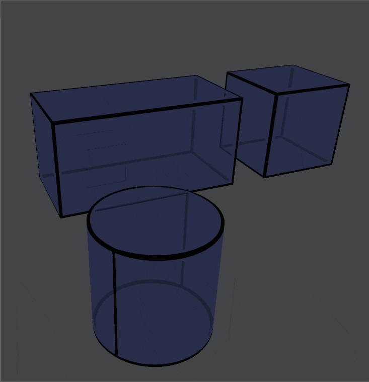

#  Wireframe Rendering Overview

The Wireframe Rendering Package performs setup and rendering of object wireframes.

It draws the sharp boundary edges of objects, instead of internal edges defined
by the triangles of the underlying 3D model.

Two components are employed to perform the wireframe rendering:

* A Renderer Feature designed for use with the
Universal Render Pipeline (URP) Renderer.
* Generated wireframe uv values that distinguish which edges should have
wireframes drawn, done on model import.

## Requirements

Requires a project using the Universal Render Pipeline.
Tested on Unity 2020.3 and URP 10.8.1.

## Getting started

All settings and options can be found under `Tools > Wireframe Rendering`.

Wireframe uv coordinates will be automatically generated for any models
imported in folders ending with `_Wireframe`
(this suffix is configurable in the settings).

Select your Universal Render Pipeline Asset
(can be found in `Project Settings > Quality`) to see the list of Renderers.
Often, this will be a single Forward renderer.

Select a Renderer, click `Add Renderer Feature` and choose
`Wireframe Rendering Feature`. Choose the Layer Mask of objects you want to
have wireframe edges added to.

Ensure that your models have logically-distinct edges, whether through sharp
edges or seams designated in your modeling software.

## Generating Wireframe Information

Beyond automatic generation based on folder name, this package uses
the `userData` field of the model's `.meta` file to hold information about
generation of wireframe uvs.

There are three relation options under `Tools > Wireframe Rendering`:

| Option | Effect |
| ------ | ------ |
| `Clear UV Coordinate Generation Information For Selected Models` | Removes any information in the `userData` field, falling back to default behaviour based on folder name. |
| `Generate UV Coordinates For Selected Models` | Adds information in `userData` field indicating that wireframe uvs should be generated, regardless of folder. |
| `Do Not Generate UV Coordinates For Selected Models` | Adds information in `userData` field indicating that wireframe uvs should not be generated, regardless of folder. |

## Wireframe Settings

Settings can be accessed under `Tools > Wireframe Rendering > Open Settings`
or through the Project Settings Window under title Wireframe Rendering.

| Setting | Effect |
| ------- | ------ |
Reimport Models | Reimports all models in the project. Although most settings changes will prompt to reimport the relevant models, you can use this to ensure all models are imported with up-to-date settings.
UV Generation Status in Project Window | Enable this to add additional text showing the status of wireframe uv coordinate generation (enabled, disabled, or automatically generated).
UV Channel | Which UV channel (from 0 through 7) the wireframe uv coordinates should be stored in. Be careful to choose a large enough value that other uv Coordinates  will not be overwritten. Default is 3, since that is the largest channel currently accessible by    ShaderGraph.
Sharp Edge Angle | Wireframe uv generation needs to be handled differently when two edges are at different enough angles to be considered not continuously connected. Generally, try to keep this as high as possible.
Do not Weld Vertices | Model import settings may have `Weld Vertices` turned on by default. Enable this option to turn off this option for imported models that have wireframe uv coordinates generated. Turning off `Weld Vertices` may prevent undesired combining of physically-identical vertices that are represented as different vertices of the model, which occurs, for example, with split sharp edges or seams.
Directory Suffix | Models found in folders whose name end in this suffix will have wireframe uvs automatically generated.
User Configurable | Whether user configuration menu items are available. When the `userData` portion of model `.meta` files is needed by other packages or assets, disabling this option will not store any information in `userData`, so uv generation will only happen automatically based on folder name.

## Wireframe Renderer Feature Settings

Settings are visible in the Inspector of the Renderer Feature.
`Tools > Wireframe Rendering > Select Renderer Feature` will select the first
Wireframe Rendering Feature found in Renderers of the  URP asset for the current
Quality setting.

### General Settings

| Setting | Effect |
| ------- | ------ |
Layer Mask | The LayerMask for objects that will have wireframe edges drawn (drawn in addition to the MeshRenderer's usual Material).
In Front Wireframe | If wireframe should be drawn for edges visible to the camera (in front of other objects).
In Behind Wireframe | If wireframe should be drawn for edges found behind other surfaces.

### Line Style Settings

Line Settings can be set separately for in-front and in-behind lines.

| Setting | Effect |
| ------- | ------ |
Color | Color of the line. Drawn with alpha blending.
Width | Thickness of the line in pixels or world-space. Set differently depending on `World Space` setting.
Falloff Width | Distance in pixels that the line fades out over.
Dash | Whether the line should be drawn dashed.
&nbsp;&nbsp; Dash Length | The length of each dash (in pixels or world-space). Set differently depending on `World Space` setting.
&nbsp;&nbsp; Empty Length | The length of space between each dash (in pixels or world-space). Set differently depending on `World Space` setting.
Apply Texture | If a texture should be applied to the line.
&nbsp;&nbsp; Texture | The texture to apply. Only r channel is used.
&nbsp;&nbsp; Keep Texture Aspect Ratio | If the texture's aspect ratio should be respected to determine the length of the texture.
&nbsp;&nbsp; Texture World Length | The length of the texture, if aspect ratio is not kept fixed.
World Space | Determines whether width and dash length are set in pixels or world-space units (m).
Fresnel | If edges should be drawn based on if an edge is oriented perpendicular to the view direction.

### Depth Fade Settings

Depth fade settings only apply to in-behind lines.

| Setting | Effect |
| ------- | ------ |
Fade With Depth | If depth of in-behind edge should be used to fade out and thin the wireframe line. Requires Camera Depth Texture to be enabled.
&nbsp;&nbsp; Depth Fade Distance | Distance scale used for depth fading.

### Haloing Settings

Haloing is only available when both in-front and in-behind lines are drawn.

With this effect, in-behind wireframes are not drawn at a given distance from in-front lines.

| Setting | Effect |
| ------- | ------ |
Haloing | If haloing effect is enabled.
&nbsp;&nbsp; Haloing Width | The distance of haloing effect in pixels from in-front wireframe line.
&nbsp;&nbsp; Stencil reference value (Advanced) | Reference value used by the stencil buffer to determine where in-front lines have been drawn.

## Model and Importing

This style of triangle-based edge rendering works best on straight edges.
Neighbouring edges with angles between them may show slight artifacts.

The underlying triangle structure of the mesh will affect how edges are drawn,
particularly other triangles sharing a vertex with two adjacent wireframe edges.
Experimenting with placement and topology of triangles can help to yield better
results, particularly for non-straight edges or for Fresnel calculations.

Wireframe edges are defined to belong to only one triangle. In practical terms,
this means that vertices of these edges must be considered logically distinct,
whether split through sharp angle / edge splitting, uv or other seams, etc.
This may also require ensure at least one subdivision of each surface of the
model.

Many of the geometry-related properties of the
[model import settings](https://docs.unity3d.com/Manual/FBXImporter-Model.html)
will affect whether vertices will be logically split on import.
These include `Normals`, `Normals Mode`, `Smoothness Source`, `Smoothing Angle`,
and `Tangents`. For low-poly style models, a good starting point might be to
choose to `Import` normals with mode `Unweighted`, a smoothness source of `None`
and `Calculate Mikktspace` tangents.

## Caveats

In some edge conditions (long boundary edge groups that contain many sharp
angles, triangles containing two boundary edges, or triangles whose vertices
all touch a boundary edge) calculation may be prohibitively expensive.
